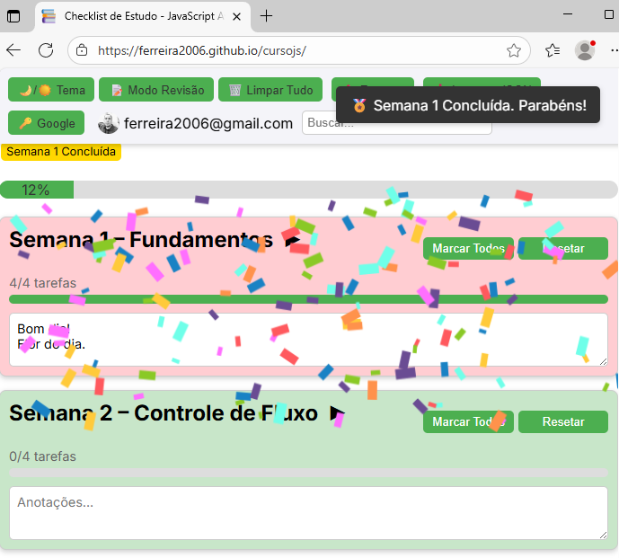
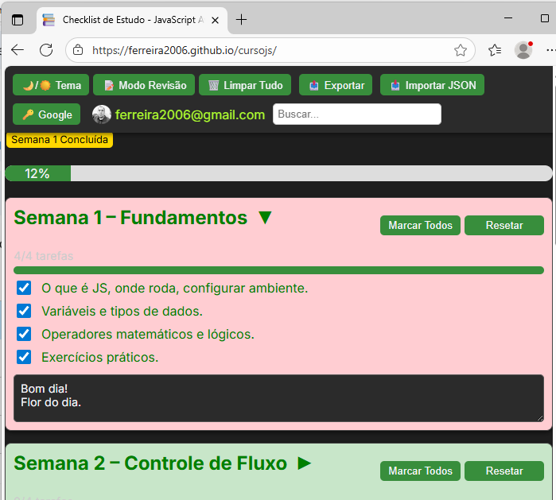

# ✅ Checklist de Estudos - JavaScript Avançado 🚀

[](https://nodejs.org/)
[](https://ferreira2006.github.io/curso-js-checklist)
[](https://cursojs-8012.onrender.com)
[]()
[](LICENSE)

💻 **Checklist interativo para estudos de JavaScript Avançado**
🌐 **Frontend**: GitHub Pages | ☁️ **Backend**: Render

---

## 🎬 Demonstração do App

<div align="center">
  
  
</div>

🎉 GIF mostrando a animação de confetes ao concluir uma semana:


---

## 🌟 Funcionalidades Principais

| 🎯 Feature                         | 🔹 Descrição                                                      |
| ---------------------------------- | ----------------------------------------------------------------- |
| 🌙 **Modo Claro/Escuro**           | Alterna tema da interface.                                        |
| ✅ **Progresso por semana e geral** | Barras de progresso automáticas e contagem de tarefas concluídas. |
| 🏅 **Badges de conclusão**         | Badges automáticos ao completar cada semana.                      |
| 📄 **Exportar dados**              | JSON, JSON Avançado, PDF e Calendário (.ics).                     |
| 📥 **Importar dados**              | Importação de JSON para continuar estudos.                        |
| 📝 **Modo Revisão**                | Destaca tarefas pendentes para revisão rápida.                    |
| 🔍 **Busca inteligente**           | Filtra tarefas e notas por palavra-chave.                         |
| 🔑 **Login com Google**            | Autenticação via OAuth2 e backup no Drive.                        |
| 💾 **Salvar no Google Drive**      | Backup total do checklist com link direto para abrir.             |
| 🔔 **Notificações Toast**          | Feedback visual para ações importantes.                           |

---

## ⚙️ Configuração Local

1. Clone o repositório:

```bash
git clone https://github.com/ferreira2006/curso-js-checklist.git
cd curso-js-checklist
```

2. Instale dependências:

```bash
npm install
```

3. Configure variáveis de ambiente criando um arquivo `.env` com:

```
CLIENT_ID=seu_client_id_google
CLIENT_SECRET=seu_client_secret_google
```

> Observação: O Redirect URI deve ser `https://cursojs-8012.onrender.com/oauth2callback` (produção) ou `http://localhost:5000/oauth2callback` (local).

4. Rode o projeto:

* `npm run dev` → Desenvolvimento com reload automático
* `npm start` → Produção

5. Abra no navegador:

```
http://localhost:5000
```

---

## ☁️ Deploy Online

* **Front-end**: GitHub Pages
* **Backend**: Render
* **Segurança**: CORS restrito, postMessage com origem fixa, tokens OAuth2 validados
* Variáveis de ambiente `CLIENT_ID` e `CLIENT_SECRET` configuradas no Render

---

## ⚠️ Observações

* O progresso é salvo em **localStorage**, funcionando mesmo sem login.
* Backup no **Google Drive** é enviado para a conta autenticada.
* Recomenda-se **navegadores modernos** para melhor performance de animações e funcionalidades.
* O app é totalmente responsivo e compatível com desktop e mobile.

---

## 👤 Autor

**Marcos Ferreira** | [GitHub](https://github.com/ferreira2006)

---

## 📝 Licença

MIT
